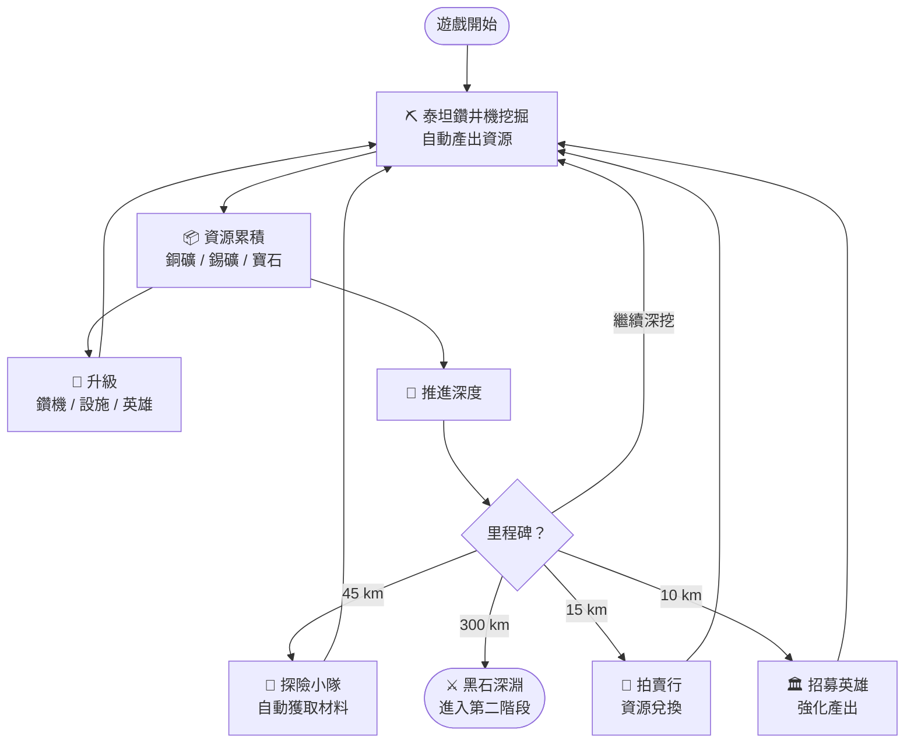

# 魔獸之礦：第一階段核心遊戲循環

**範圍**：遊戲開局 → 300 km（解鎖黑石深淵戰鬥系統）

---

## 核心循環

---

## 里程碑一覽

| 深度 | 解鎖 | 效益 |
|:---:|:---|:---|
| 10 km | 英雄祭壇 | 招募英雄，被動強化採礦效率 |
| 15 km | 拍賣行 | 多餘資源兌換稀缺材料 |
| 45 km | 探險小隊 | 掛機派遣，自動取得技能材料 |
| 300 km | 黑石深淵 | 解鎖戰鬥系統，進入第二階段 |

---

*文件版本：v1.1 | 2026-03-10*
