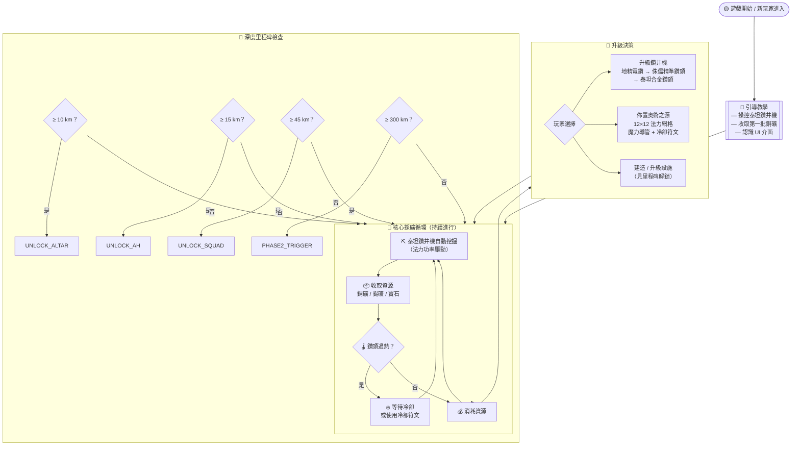
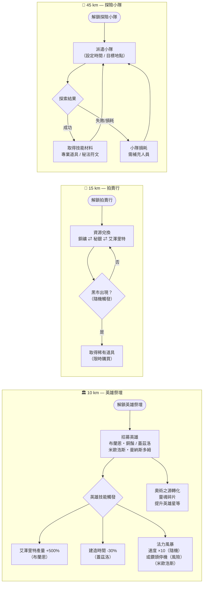
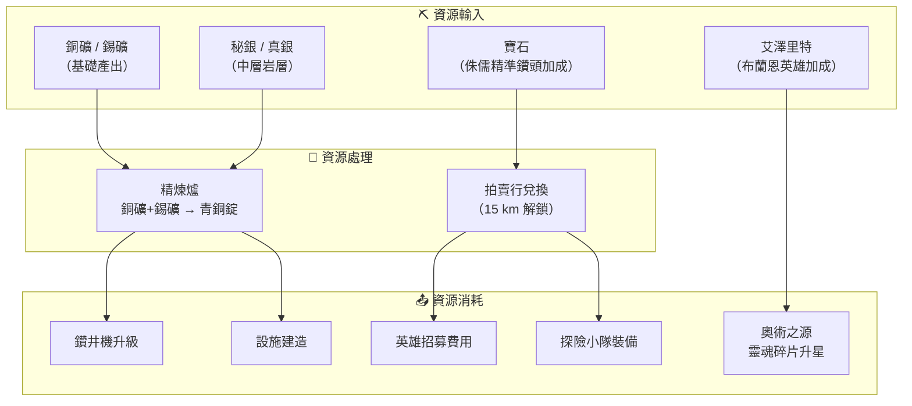
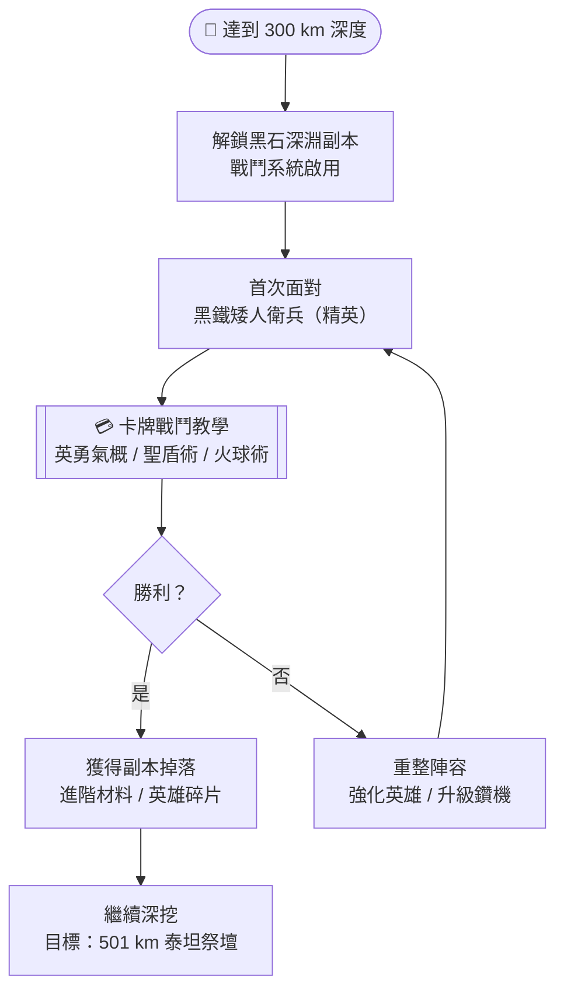
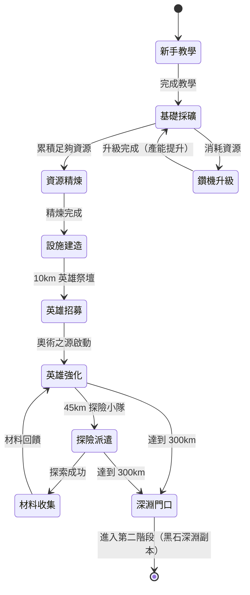

# 魔獸之礦：第一階段核心遊戲循環流程圖

## 概述

第一階段定義為遊戲開局至抵達 **300 km 深度**（解鎖黑石深淵戰鬥系統）。
本階段的核心體驗是：**建立採礦基地 → 累積資源 → 招募英雄 → 解鎖設施 → 推進深度**。

---

## 主循環總覽

---

## 里程碑解鎖分支

---

## 資源流向圖

---

## 第一階段結束條件 → 進入第二階段

---

## 玩家決策優先序（第一階段建議路線）

| 優先級 | 行動 | 目標 |
|:---:|:---|:---|
| 1 | 升級泰坦鑽井機至侏儒精準鑽頭 | 提升採礦速度與寶石發現率 |
| 2 | 抵達 10 km，招募布蘭恩・銅鬚 | 艾澤里特產量 ×5 |
| 3 | 佈置奧術之源基礎網格 | 開始累積英雄靈魂碎片 |
| 4 | 抵達 15 km，啟用拍賣行 | 多餘資源兌換為稀缺材料 |
| 5 | 升級布蘭恩至 2★ | 強化被動產出效益 |
| 6 | 抵達 45 km，解鎖探險小隊 | 自動獲取技能材料 |
| 7 | 持續深挖 45 km → 300 km | 第二英雄槽 + 黑石深淵 |
| 8 | 升級泰坦合金鑽頭（最終形態） | 無視岩層阻力，加速推進 |

---

## 狀態機簡圖（玩家狀態）

---

*文件版本：v1.0 | 建立日期：2026-03-10 | 對應 GDD 版本：V1*
